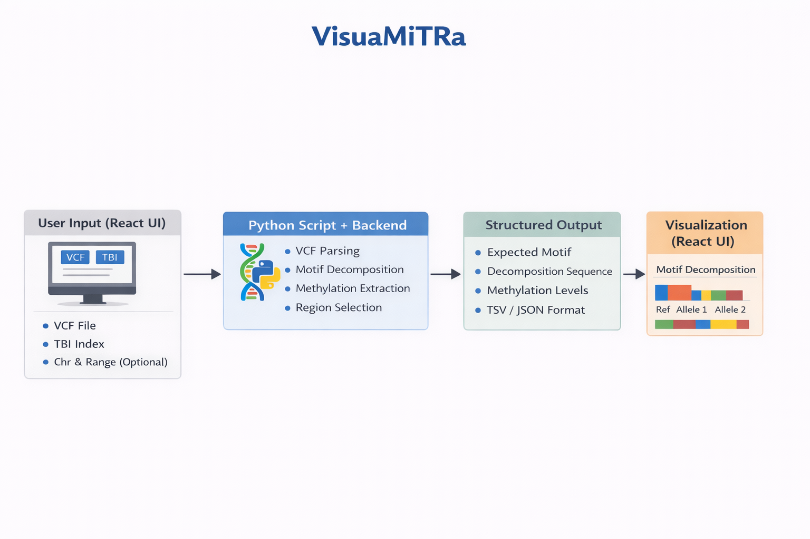
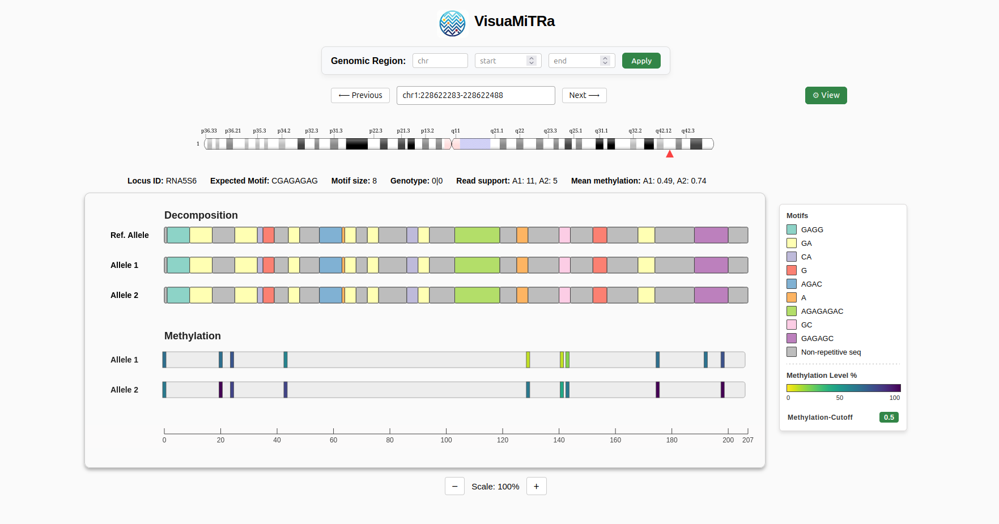
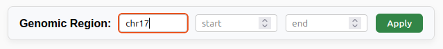
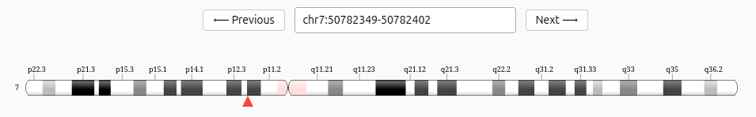
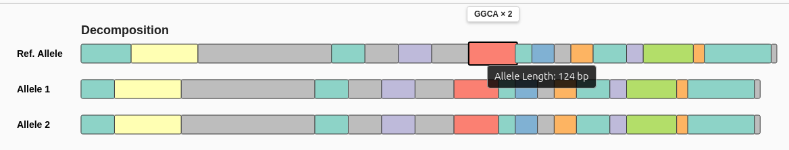
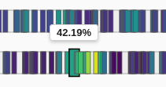
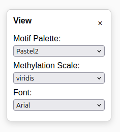

# VisuaMiTRA - a Tandem Repeat Visualizer

<div align="center">
  
  <p><i>VisuaMiTRa</i></p>
</div>

**VisuaMiTRa** (pronounced vi-shu-uh-mee-truh, IPA: /vɪʃuəmiːtrə/, Sanskrit: विश्वमित्र) is a specialized visualization tool for tandem repeat alleles, designed for a concise overview of motif decomposition, and corresponding epigenetic methylation signals. The name expands to **VISUAlisation of Motifs & Methylation in Tandem Repeat Alleles**.

The name is derived from the Sanskrit word Vishvamitra (विश्वमित्र), meaning "Friend of the Universe." In this context, VisuaMiTRa acts as a companion to the researcher, providing a clear comprehensive overview of tandem repeat complexity. By layering structural motifs and methylation data into a single, intuitive interface, it transforms dense genomic files into an accessible and navigable landscape.

# Motivation

The high-resolution genotypes and methylation profiles generated by [**ATaRVa**](https://github.com/SowpatiLab/ATaRVa) require an integrated perspective to be clearly interpreted. VisuaMiTRa is the essential next step, transforming VCF data outputs into an interactive landscape where structural motifs and epigenetic methylation signals align. Providing this overview enables researchers to rapidly validate and navigate ATaRVa's results at scale.

# Table of Contents

* [Motivation](#motivation)
* [Installation](#installation)
* [Usage](#usage)
  * [Workflow](#workflow)
  * [Features](#features)
* [Data Requirements](#data-requirements)
* [Citation](#citation)
* [Contacts](#contacts)

# Installation

VisuaMiTRa is available as a Python package that manages both the backend server and the compiled frontend automatically.

Prerequisites: Python 3.9+ and htslib (for Tabix functionality).


### Create and activate a python environment (recommended)
```python -m venv venv
source venv/bin/activate  # On Windows use: venv\Scripts\activate
```

### Install the package
```
pip install visuamitra
```

# Usage

Once installed, you can launch the visualization suite with a single command:
```Bash
visuamitra
```

Access: The application will automatically initialize and host the interface on port 8088. Open your web browser and navigate to http://localhost:8088.

## Workflow

<div align="center">
  
  <p><i>Fig 1: Workflow of visuamitra</i></p>
</div>

 VisuaMiTRa uses a high-performance backend designed for rapid random access and minimal memory overhead.

Data Ingestion: Users provide a Tabix-indexed VCF file and its .tbi index (generated by ATaRVa).

Validation:  FastAPI performs a preflight check using pysam to ensure the requested genomic region exists, preventing empty streams and invalid coordinate errors.

Pagination: To handle large data, the tool uses Base64-encoded cursors which allows to 'bookmark' positions and fetch subsequent pages without re-scanning  entire files.

Optimized Streaming: Data is streamed in small chunks and delivered in real-time to ensure the tool remains fast and lightweight, even with very large files.

Reactive Visualization:  React parses the TSV stream into an interactive SVG canvas, mapping structural motifs and methylation probabilities in real-time.

<div align="center">
  
  <p><i>Fig 2: Overview of visuamitra</i></p>
</div>

## ✨ Features

VisuaMiTRa provides a comprehensive and intuitive overview of tandem repeat complexity.

#### 🧬 Integrated Motif & Methylation Mapping

* Observe the direct relationship between structural variation and epigenetic signals. Methylation tracks are layered precisely over motif decomposition blocks to show allele-specific patterns.


#### 📍 Effortless Navigation
* Target specific loci using coordinate inputs (Chr, Start, End) or manually browse thousands of records smoothly and an interactive with a track of physical context in Chromosome.

<div align="center">
  
  <p><i>Fig 3: Location inputs </i></p>
</div>

<div align="center">
  
  <p><i>Fig 4: Chromosome context </i></p>
</div>

#### 📏 Interactive Interface

* Magnify in or out of intricate regions to ease data interpretation.

* Hover over motif segments or bars to instantly view repeat counts and allele base-pair lengths. Methylation levels as well.

* Customize view with professional color palettes & scales(Viridis, Magma, Set3), and fonts.

<div align="center">
  
  <p><i>Fig 5: Repeat counts & Allele length </i></p>
</div>

<div align="center">
  <table>
    <tr>
      <td align="center">
        
        <br />
        <i>Fig 6: Methylation bars</i>
      </td>
      <td align="center">
        
        <br />
        <i>Fig 7: View settings</i>
      </td>
    </tr>
  </table>
</div>


 [↑ Back to Top](#visuamitra---a-tandem-repeat-visualizer)


## Contacts

Authors: Abhishek Kumar, Divya Tej Sowpati, Siddharth K

Email: 

GitHub: [Link to Repository]


