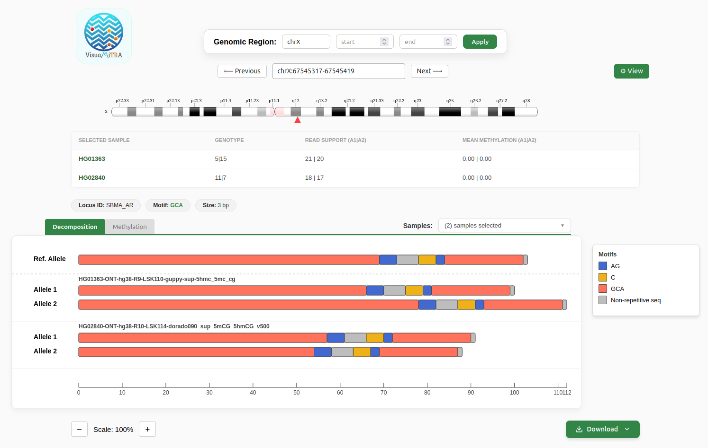
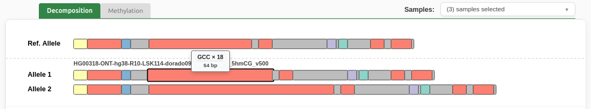
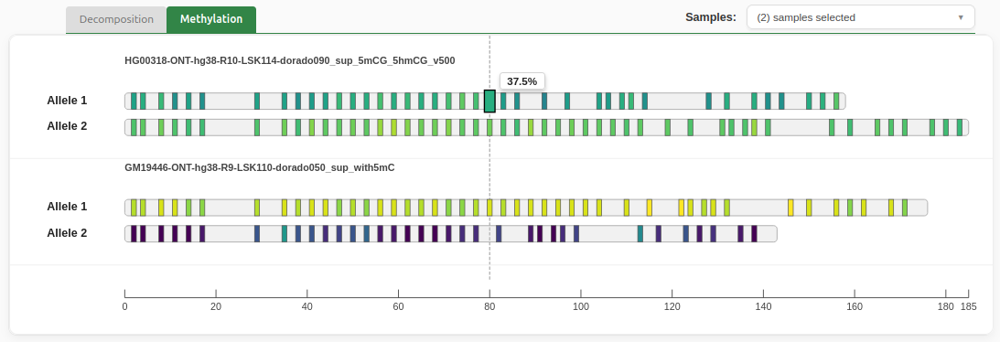
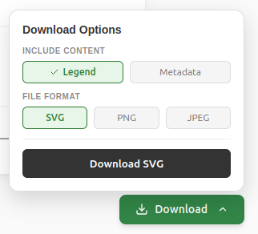
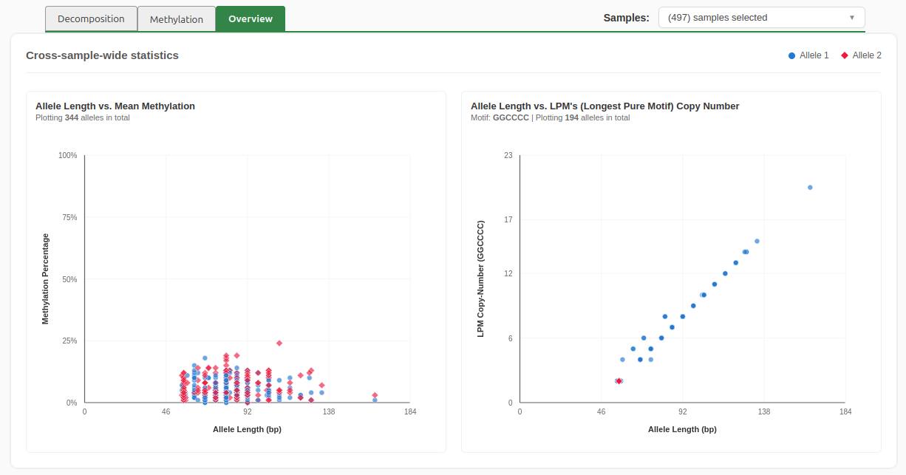

# VisuaMiTRA - a Tandem Repeat Visualizer

<div align="center">
  
  <!-- <p><i>VisuaMiTRa</i></p> -->
</div>

**VisuaMiTRa** (pronounced vi-shu-uh-mee-truh, IPA: /vɪʃuəmiːtrə/, Sanskrit: विश्वमित्र) is a specialized visualization tool for Tandem Repeat alleles, designed for a concise overview of motif decomposition, and corresponding epigenetic methylation signals. The name expands to **VISUAlisation of Motifs & Methylation in Tandem Repeat Alleles**.

The name is derived from the Sanskrit word Vishvamitra (विश्वमित्र), meaning "Friend of the Universe." In this context, VisuaMiTRa acts as a companion to the researcher, providing a clear comprehensive overview of tandem repeat complexity. By layering structural motifs and methylation data into a single, intuitive interface, it transforms dense genomic variant files into an accessible and navigable landscape.

# Motivation
The high-resolution genotypes and methylation profiles generated by [**ATaRVa**](https://github.com/SowpatiLab/ATaRVa) require an integrated perspective to be clearly interpreted. VisuaMiTRa is the essential next step, transforming VCF data outputs into a visual interface where structural motifs and epigenetic methylation signals align. Providing this overview enables researchers to rapidly validate and navigate ATaRVa's results at scale.

# Table of Contents

* [Motivation](#motivation)
* [Installation](#installation)
* [Usage](#usage)
  * [Workflow](#workflow)
  * [Features](#features)
* [Data Requirements](#data-requirements)
* [Citation](#citation)
* [Contacts](#contacts)

# Installation

VisuaMiTRa is available as a Python package that manages both the backend server and the compiled frontend automatically.

Prerequisites: Python 3.9+ and htslib (for Tabix functionality).


### Create and activate a python environment (recommended)
```python -m venv venv
source venv/bin/activate  # On Windows use: venv\Scripts\activate
```

### Install the package
```
pip install visuamitra
```

# Usage

**Visuamitra v1.0.3** is compatible with **ATaRVa ( > v0.7.0)**
#### Browser mode
Once installed, to launch the tool and manually select or upload your VCF files via the web interface:
```Bash
visuamitra
```

#### CLI Mode

Rather than browser upload, passing the vcf file path as argument will launch visuamitra.

```Bash
visuamitra /path/to/your/file.vcf.gz
```
Note: The corresponding .tbi index file must reside in the same directory as the target .vcf.gz file, with same name (e.g., file.vcf.gz.tbi).

Access: The application will initialize and host the interface on port 8088. Open your web browser and navigate to http://localhost:8088.

## Workflow

<div align="center">
  
  <p><i>Fig 1: Workflow of visuamitra</i></p>
</div>

 VisuaMiTRa uses a high-performance backend designed for rapid random access and minimal memory overhead.

Data Ingestion: Users provide a Tabix-indexed VCF file and its .tbi index (generated by ATaRVa).

Validation:  FastAPI performs a preflight check using pysam to ensure the requested genomic region exists, preventing empty streams and invalid coordinate errors.

Pagination: To handle large data, the tool uses Base64-encoded cursors which allows to 'bookmark' positions and fetch subsequent pages without re-scanning  entire files.

Optimized Streaming: Data is streamed in small chunks and delivered in real-time to ensure the tool remains fast and lightweight, even with very large files.

Reactive Visualization:  React parses the TSV stream into an interactive SVG canvas, mapping structural motifs and methylation probabilities in real-time.

<div align="center">
  
  <p><i>Fig 2: visuamitra</i></p>
</div>

## ✨ Features

VisuaMiTRa provides a comprehensive and intuitive overview of tandem repeat complexity.


#### 👥 Multi-Sample Comparative Analysis

VisuaMiTRa now supports the simultaneous visualization of multiple samples from a merged VCF.

  * Dynamic Selection: Choose which samples to display using a searchable dropdown menu.

  * Synchronized Scaling: All selected samples are rendered on a shared genomic scale, allowing for direct visual comparison of allele lengths, motifs and methylation patterns across  cohorts.


#### 🧬 Dual View for Motifs & Methylation

* VisuaMiTRa features independent tabs for motif decomposition & methylation that maintain strict allele-length consistency, enabling precise  comparison across multiple samples.

#### 📍 Effortless Navigation
* Target specific loci using coordinate inputs (Chr, Start, End) or manually browse thousands of records smoothly, alongside an indicator with a track of genomic context in Chromosome. (Note: visuamitra v1.0.3 currently supports Hg38 assembly reference only.)

<div align="center">
  
  <p><i>Fig 3: Location inputs </i></p>
</div>

<div align="center">
  
  <p><i>Fig 4: Chromosome context </i></p>
</div>

#### 📏 Interactive Interface

* Magnify in or out of intricate regions to ease data interpretation.

* Hover over motif segments to instantly view repeat counts. Methylation levels markers for clearer visualisation.

* Customize view with professional color palettes, scales & fonts.

* The expected motif can be viewed in interchangeable colors, within a palette as well (New in v1.0.3).


<div align="center">
  
  <p><i>Fig 5: Repeat counts </i></p>
</div>
<div align="center">
  
  <p><i>Fig 6: Methylation markers </i></p>
</div>


#### 💾 Download plots 

  * Publication-Ready SVGs: Download high-resolution vector graphics of the viewed genomic locations.

  * Genomic plots could also be downloaded as PNG/JPGs.

  <!-- <div align="center">
  
  <p><i>Fig 7: Download options </i></p>
</div> -->

#### 📊 Overview Tab (New in v1.0.3)

* A third tab with a comparitive summary of the samples selected. 

* Encompasses plots showing variation of methylation, 'the copy number of the longest pure motif found', with allele lengths.

<div align="center">
  
  <p><i>Fig 7: Overview tab </i></p>
</div>


 [↑ Back to Top](#visuamitra---a-tandem-repeat-visualizer)


## Contacts

Authors: Siddharth K, Abishek Kumar, Divya Tej Sowpati

Email: Siddharth K - siddharthk at csirccmb dot org

Abishek Kumar S - abishekks at csirccmb dot org

Divya Tej Sowpati - tej at csirccmb dot org


